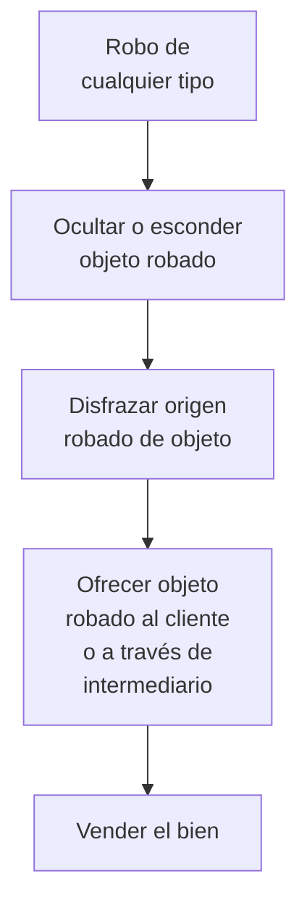

## Introducción

{}

La presente guía aborda el problema de los mercados de bienes robados.
El objetivo final de reducir el mercado de bienes robados es hacer más
difícil y arriesgado para las personas comerciar con bienes robados y,
por lo tanto, desalentar el robo en primer lugar.

{}

## El Problema del Mercado de Bienes Robados

La mayoría de los ladrones roban para recaudar dinero, y para esto
necesitan vender lo que roban. Esto requiere que exista un mercado de
bienes robados que no sólo proporcione un punto de venta, sino que esté
alimentado por una demanda constante de los bienes robados.

### Resumen General del Problema

Los mercados de bienes robados facilitan la demanda que genera mucho
robo de propiedad.

Muchos mercados de bienes robados son clandestinos, lo que los hace más
difícil de investigar y abordar. Sin embargo, mucho comercio de bienes
robados se lleva a cabo en plena luz del día, como en lugares donde
bienes se venden abiertamente en las calles o en casas de empeño o de
segunda mano.

Recolectar evidencia suficiente para procesar a un vendedor o
intermediario de bienes robados[^1] es difícil, ya que estas personas
pueden fácilmente disimular sus actividades ilegítimas detrás de
fachadas comerciales legítimas. Las personas que hacen esto
profesionalmente saben cómo hacerlo bien y pueden operar con impunidad
durante años.

### Daños causados por el Mercado de Bienes Robados

Los mercados de bienes robados causan una serie de daños sociales. En
algunos casos, están vinculados a iniciativas criminales organizadas más
grandes y sofisticadas. Quienes compran bienes robados crean una demanda
que aumenta sus riesgos de victimización, además de la victimización de otros.
Adicionalmente, debido a que los individuos involucrados en mercados de
bienes robados no pueden recurrir a métodos legales para resolver
disputas por temor a ser descubiertos, a menudo recurren a
la violencia para estos fines.

## Factores que contribuyen a los Mercados de Bienes Robados

Entender los factores que contribuyen al problema ayuda a enmarcar las
preguntas de análisis local, determinar buenas medidas de efectividad,
reconocer puntos de intervención claves, y seleccionar respuestas
apropiadas.

### Transacciones

El comercio de bienes robados típicamente incluye varios pasos,
comenzando con el robo mismo, y terminando con el consumidor final
obteniendo los bienes.

#### Cadena de transacciones de bienes robados

<!--
1. Robo (de cualquier tipo)
2. Ocultamiento de bien robado

-->

**5.2. Oferta y Demanda: el Tema Clave en la Mayoría de los Robos**

Como con cualquier mercado, la relación entre oferta y demanda por
bienes robados puede ser compleja. Generalmente, la demanda de bienes
robados aumenta la incidencia del robo. Esto tiene sentido debido a que,
en su mayoría, los ladrones no robarán bienes a no ser que primero sepan
o crean que otros los comprarán o intercambiarán por ellos. Un
entendimiento general sobre si los dueños de negocios y el público en
general están dispuestos a comprar bienes robados motiva a los ladrones
a comenzar y continuar robando.

A veces los ladrones roban artículos por encargo. Esto significado que
son requeridos para proveer productos particulares a través del robo. De
esta manera, los comerciantes prolíficos de bienes robados tienden a
alentar a los ladrones a aumentar sus actividades delictivas. Sin
embargo, robar por encargo no es tan frecuente como robar para ofrecer
en el mercado.

**5.3. Bienes Frecuentemente Robados y Vendidos**

El conocimiento de la “demanda permanente” de bienes robados afecta el
tipo de bienes robados, dependiendo lo que más se demanda en ese
momento, y a veces puede generar oleadas de delitos problemáticos cuando
los ladrones se enfocan en bienes específicos muy buscados. La
investigación académica muestra que la mayoría de los ladrones actúa en
base a una jerarquía en constante cambio de bienes que prefieren robar.
La investigación directa con ladrones revela que rara vez acumulan
bienes robados por más de una hora o dos, ya que buscan una rápida
devolución de dinero en efectivo y quieren evitar ser atrapados con los
bienes en su poder. Esto significa que es poco probable que los ladrones
roben y almacenen bienes de los que no saben la demanda actual, en caso
de que sean vendibles en un futuro. Dado que la mayoría de los ladrones
roba para obtener dinero rápidamente, el efectivo está en la parte
superior de su lista, seguido por artículos que pueden vender fácil y
rápidamente a precios relativamente altos, como joyas y equipos de
entretenimiento de alta tecnología para el hogar.

Entender qué hace que los productos sean atractivos para los ladrones
ayuda a anticipar nuevos objetivos de robo, y consecuentemente
comprender qué nuevos productos pueden llegar a ser populares en los
mercados de bienes robados. Los llamados *productos calientes* suelen
tener una o más de las siguientes características, que pueden resumirse
con la sigla CRAVED (por sus iniciales en inglés):

**C**oncealable (Ocultable)

**R**emovable (Extraíble)

**A**vailable (Disponible)

**V**aluable (Valioso)

**E**njoyable (Deseado)

**D**isposable (Deshechable)

Mientras más de estas características tenga un producto, más atractivo
será para que alguien lo robe. Sin embargo, ya que sabemos que los
ladrones prolíficos rara vez roban artículos para uso propio, las
últimas tres características son las más relevantes debido a que se
relacionan con el valor de un artículo, y no únicamente a su
portabilidad. Es este *valor* de los artículos el que los hace
descartables como productos cuando los ladrones desean vender o
intercambiar artículos robados por drogas.

**5.4. Ubicaciones y Horarios de los Mercados de Bienes Robados**

Aunque el robo puede ocurrir en cualquier lugar donde haya algo para
robar, muchos robos en domicilios y otros tipos de robo se concentran en
áreas específicas, y los ladrones se aprovechan más frecuentemente de
personas en esas áreas.

Los ladrones generalmente prefieren vender bienes robados localmente y
rápidamente (en cuestión de horas en vez de días). Por lo tanto, una
concentración de robos locales podría (pero no necesariamente) indicar
la proximidad relativa de un mercado local para esos bienes. Sin
embargo, debe tenerse en cuenta que si bien este fenómeno es algo que
vale la pena explorar en primera instancia, no debe hacerse a expensas
de descuidar otros mercados más lejanos pero más importantes.

**5.5. Compradores de Bienes Robados**

Además de comerciantes profesionales de bienes robados, los ciudadanos
normales compran bienes robados. A su vez, los dueños de negocios
también pueden ser susceptibles a comprar bienes robados. Esto mismo se
cumple para comerciantes y cualquier otra persona en la población que
encuentren difícil resistir la posibilidad de una ganga sin regatear ni
hacer muchas preguntas.

**5.6. Tolerancia del Público a los Mercados de Bienes Robados**

Mientras que la mayoría de los ciudadanos no toleran a los ladrones ni
al robo, tienden a ser más tolerantes con los compradores y vendedores
de bienes robados. Esto usualmente se debe a que son vistos como
emprendedores o empresarios que brindan un servicio local poniendo a
disposición del público bienes a precios reducidos.

**5.7. Vínculos con Uso Ilícito de Substancias**

Los mercados de bienes robados juegan un papel importante en los
mercados de drogas al explicar las altas tasas de robo y, por lo tanto,
representan una oportunidad importante para iniciativas de reducción del
delito. Dicho esto, los narcotraficantes pueden aceptar ciertos tipos de
artículos a cambio de drogas, y también los pueden comprar directamente.
Se sabe que los narcotraficantes compran en particular ropa de diseñador
y joyas para uso propio. Comprar y vender productos robados es, para
muchos delincuentes, un delito de entrada a la compra y venta de drogas.

**5.8. Tipos de Mercados de Bienes Robados**

Los mercados de bienes robados tienden a presentar características
locales particulares en términos de lo que roban los ladrones y como
aquellos involucrados llevan a cabo transacciones. En consecuencia,
reducir estos mercados locales requiere de soluciones adaptadas a la
realidad local.

Existen seis tipos de mercados de bienes robados que difieren en los
modos en que los ladrones, los comerciantes o intermediarios y los
consumidores operan. Ningún tipo de mercado es más serio o importante
que otro en términos del papel que desempeña promoviendo el robo. Los
seis tipos de mercados son los siguientes:

  - **Proveedores de intermediarios comerciales:** Los ladrones venden
    bienes robados a intermediarios comerciales, quienes operan en
    tiendas como joyerías, casa de empeño y locales de segunda mano.

  - **Proveedores de intermediarios residenciales:** Los ladrones venden
    bienes robados (especialmente bienes electrónicos) a intermediarios,
    generalmente en los hogares de estos últimos.

  - **Ventas en red:** Los ladrones traspasan los bienes robados, y cada
    participante de la red aumenta un poco el precio hasta que se
    encuentra un consumidor. Esto puede involucrar a un intermediario
    residencial, y el comprador puede ser el consumidor final o puede
    vender los bienes nuevamente a través de otros vínculos sociales.

  - **Ventas comerciales:** Los intermediarios comerciales generalmente
    se presentan abiertamente como dueños de negocios legítimos mientras
    venden en secreto bienes robados para obtener ganancias, ya sea
    directamente al consumidor (inocente) o, más infrecuentemente, a
    otro distribuidor que piensa que podría revender los bienes para
    obtener ganancias adicionales.

  - **Venta en Lugares Públicos:** Los ladrones venden directamente a
    los consumidores en lugares como bares, pubs o incluso puerta a
    puerta (e.g., ladrones de tiendas pueden vender cigarrillos,
    artículos de baño, ropa o comida).

  - **“eSelling”:** Este tipo de mercado implica la venta de bienes
    robados a través de sitios web privados o en sitios de subastas en
    línea, tales como eBay, Facebook Marketplace o MercadoLibre. Esto
    les da a los ladrones acceso a compradores que de otro modo no
    podrían alcanzar.

**5.9. El Dilema del Vendedor**

Entender los dilemas a los que se enfrentan las personas que
comercializan bienes robados es útil para diseñar estrategias de
prevención y control.

El dilema del vendedor de bienes robados es que para aumentar sus
posibilidades de obtener una ganancia tiene que aumentar los riesgos de
ser descubierto. El vendedor puede elegir vender únicamente a individuos
conocidos, lo que reduce los riesgos de ser engañado o detectado, pero
restringe sus ventas y oportunidades de compra. Por otra parte, el
vendedor puede vender a desconocidos, lo que le permite tener acceso a
más clientes potenciales, pero a la vez aumenta sus posibilidades de
ser detenido o engañado.

**5.10. Intermediarios**

Algunos traficantes de bienes robados son intermediarios profesionales,
que disimulan sus actividades detrás de fachadas comerciales legítimas.
Otros no lo son, pero en vez operan desde sus propios hogares, o
desplazándose de un lugar a otro, usando por ejemplo redes de asociados
vinculados a través de teléfonos móviles. En otros mercados, los
consumidores y los distribuidores inocentes pueden comprar directamente
a los ladrones en vez de hacerlo a través de un intermediario.

**5.11. Principios Básicos de los Intermediarios**

Para que un intermediario profesional pueda operar y evitar su
detención, necesita entrenar a ladrones promisorios para evitar la
detección y maximizar las ganancias. Debe ocultar sus actividades con
bienes robados detrás de una fachada comercial legítima. También debe
permanecer deliberadamente ignorantes respecto de si los bienes que
compra de otros distribuidores son a su vez robados. Debe intentar
descargar rápidamente los bienes robados para evitar ser detectado, pero
también saber cuándo es más seguro almacenarlos y venderlos más tarde.
Debe evitar ser descubierto en posesión de bienes robados, pero en caso
de que lo sea, debe saber cómo dificultar a la policía para que pueda
demostrar que estaba en conocimiento de que los bienes fueron robados.

**5.12. Método de Operación**

Los ladrones inexpertos tienden a vender principalmente a desconocidos
en lugares públicos o vendiendo sólo a un intermediario residencial
conocido. En particular, los usuarios problemáticos de drogas a menudo
encuentran difícil ubicar a intermediarios con quienes hacer negocios.
Los delincuentes más experimentados y prolíficos tienden a conocer la
mayoría de las formas de vender bienes robados en una variedad de
mercados.

**6. Entendiendo Su Problema Local**

Toda la información provista anteriormente constituye sólo una
descripción general de los mercados de bienes robados. Se deben
combinar los hechos básicos con un entendimiento más específico del
problema local. Analizar el problema local cuidadosamente ayudará a
diseñar una estrategia de respuesta más efectiva.

Para entender las dinámicas de los mercados de bienes robados en su
área, se debe entrevistar a delincuentes e informantes conocidos. Es
importante hablar con quienes roban, venden, comercializan y usan
propiedad robada, así como aquellos que pueden saber sobre estas
personas. Generalmente, se debe solicitar información a los siguientes
grupos:

  - Delincuentes actuales, recientemente activos y exdelincuentes
    (ladrones, intermediarios, narcotraficantes, usuarios de drogas);

  - Presos (condenados por robo, comercialización de bienes robados, y
    uso o tráfico de drogas); y,

  - Informantes confidenciales.

También se debe asegurar de que el público pueda denunciar a la policía,
de manera fácil y confidencial, sobre cualquier actividad sospechosa
relacionada con bienes robados.

**7. Partes Interesadas**

Además de las entidades locales de justicia penal, los siguientes grupos
tienen intereses en el problema del comercio de bienes robados, y se
debería considerar la contribución que podrían hacer para recolectar
información sobre el problema y responder a él:

  - Las *asociaciones comerciales* (e.g., que representan a vendedores
    minoristas, bares, comerciantes de chatarra) tienen un interés en
    evitar que los comerciantes de bienes robados socaven la
    participación en el mercado de comerciantes legítimos, y pueden
    saber qué comerciantes son sospechosos de tratar con bienes robados.

  - Los *profesionales de prevención de pérdida de activos* tienen un
    interés en reducir las pérdidas derivadas de desvíos de mercancía
    mayoristas compradas legítimamente a los mercados ilegítimos de
    bienes robados.

  - Las *líneas directas de denuncia de delitos* pueden tener
    información sobre presuntos ladrones e intermediarios en
    particular, así como sobre tendencias emergentes.

  - Las *autoridades tributarias* están interesadas en detener ingresos
    fiscales perdidos atribuibles al comercio de bienes robados y pueden
    tener información respecto a entidades comerciales sospechosas.

  - Las *entidades reguladoras* saben qué tipo de regulaciones legales
    pueden aplicar a empresas sospechosas de comercializar bienes
    robados.

  - Las agencias policiales nacionales y estatales podrían saber cómo
    los mercados de bienes robados locales están conectados a
    organizaciones criminales más grandes y sofisticadas.

**8. Haciendo las Preguntas Correctas**

Las siguientes son algunas preguntas claves que se deberían tener en
cuenta al analizar los problemas de mercados de bienes robados, incluso
si las respuestas no siempre están disponibles. Las respuestas a éstas y
a otras preguntas ayudarán a elegir el conjunto más apropiado de
respuestas.

**8.1. Mercados de Bienes Robados**

  - ¿Cuánto comercio de bienes robados ocurre en su jurisdicción?
    (Recuerde que los datos de delitos registrados por la policía
    oficial son de poca ayuda para esto, ya que el público rara vez
    denuncia tales delitos, y muchos casos de recepción de artículos
    robados son en realidad casos en los que los ladrones se declararon
    culpables de un cargo menor cuando la evidencia del robo original es
    débil).

  - ¿Cuáles tipos de mercados de bienes robados comercializan qué tipos
    específicos de bienes?

  - ¿Se están reduciendo o incluso cerrando algunos tipos de mercados?
    ¿Están surgiendo nuevos tipos de mercados?

  - ¿Dónde se ubican los mercados para tipos específicos de bienes
    robados?

  - ¿Cuál es el descuento típico para bienes robados? ¿El descuento está
    aumentando o disminuyendo?

  - ¿Qué proporción de bienes robados en su jurisdicción estima que son
    vendidos posteriormente en mercados de bienes robados, en lugar de
    ser usados por el ladrón, recuperados por la policía o descartados?

  - ¿Cuán fácil y rápido es para *los ladrones* encontrar un comprador
    para sus bienes robados?

  - ¿Cuán fácil y rápido es para *los intermediarios* encontrar un
    comprador para sus bienes robados?

  - ¿Cómo transportan los ladrones los bienes robados a los
    intermediarios?

  - ¿Qué suelen hacer los ladrones con los bienes inmediatamente después
    de robarlos (e.g., los venden o intercambian en la calle; los
    ocultan mientras buscan un comprador; los venden a una casa de
    empeño o a un intermediario)?

  - ¿Con qué frecuencia los ladrones necesitan deshacerse de bienes que
    pueden vender?

**8.2. Delincuentes**

Ladrones

  - ¿Quién hace negocios con determinados tipos de bienes robados? ¿En
    qué mercado(s) los hace y cómo?

  - ¿Qué perciben los ladrones como *riesgos* de vender bienes robados?

  - ¿Qué perciben los ladrones como *recompensas* de vender bienes
    robados?

  - ¿Cómo evitan los ladrones la detección al vender bienes robados?

  - ¿Cómo aprenden los ladrones dónde vender bienes robados?

  - ¿Qué tan seguros se sienten los ladrones transportando y almacenando
    bienes robados?

  - ¿Qué tan seguros se sienten los ladrones al lidiar con un
    intermediario?

  - ¿Qué tan preocupados se sienten los ladrones por ser descubiertos?

  - ¿Cuánto saben los ladrones sobre las operaciones policiales contra
    el tráfico de bienes robados?

Intemediarios

  - ¿Quiénes son los intermediarios (e.g., profesionales; comerciantes
    semi-legítimos)?

  - ¿Qué perciben los intermediarios como *riesgos* de vender bienes
    robados?

  - ¿Qué perciben los intermediarios como *recompensas* de vender bienes
    robados?

Consumidores

  - ¿Quién en su jurisdicción tiende a comprar bienes que saben o
    deberían sospechar que han sido robados?

  - ¿Qué perciben los consumidores como *riesgos* de comprar bienes
    robados?

  - ¿Qué perciben los consumidores como *recompensas* de comprar bienes
    robados?

> **8.3. Objetivos**

  - ¿Qué tipos de bienes se venden comúnmente en los mercados de bienes
    robados?

  - ¿Qué tipos de artículos específicos son recientemente cotizados?

> **8.4. Ubicaciones y Horarios**

  - ¿Dónde se ubican las operaciones de intermediarios dentro de su
    jurisdicción?

  - ¿Existen variaciones estacionales en los tipos de bienes transados
    en mercados de bienes robados (e.g., cortacéspedes en verano;
    electrónica y computadores portátiles al comienzo de los años
    académicos; libros de textos universitarios al comienzo de los
    semestres y justo antes de los periodos de exámenes)?

***Consejos para Entender los Mercados Locales de Bienes Robados***

  - Entrevistar a una muestra de personas que trabajan en los sectores
    de bienes mayoristas y minoristas. Sin hablar sobre el delito,
    averigüe cómo y por qué algunos productos son rechazados o
    transportados fuera de las tiendas que los compraron legítimamente y
    donde terminan estos artículos.

  - Mapee posibles puntos calientes de mercados de bienes robados.
    Analice con colegas, informantes, delincuentes, exdelincuentes y
    otros expertos, tales como funcionarios públicos o criminólogos
    respecto a por qué ciertas áreas pueden ser propicias para los
    mercados de bienes robados.

  - Fotografíe letreros de tiendas en su jurisdicción que parezcan
    invitar a los ladrones a vender productos robados ahí. Nuevamente,
    analice junto a otros que puedan contribuir su conocimiento y
    expertise.

  - La realización de encuestas representativas a víctimas de robo y al
    público de una comuna, departamento, pueblo o ciudad es costoso,
    lleva mucho tiempo y, debido a las características específicas de
    los problemas de delincuencia local, ofrece poca información útil
    para iniciativas locales.

**9. Midiendo Su Efectividad**

La medición permite determinar en qué grado los esfuerzos han tenido
éxito y sugiere como se podrían modificar las respuestas si no está
produciendo los resultados deseados. Se deberían medir los problemas
delictuales *antes* de implementar respuestas, para así determinar cuán
serios son los problemas, y *después* de implementarlas, para determinar
si es que fueron efectivas. Se debería tomar mediciones tanto en el área
objetivo como en un área de control, como por ejemplo el área
circundante. Por lo general, se necesita un periodo de tiempo de al
menos tres meses para medir el impacto de las respuestas a los mercados
de bienes robados.

[^1]: Un receptor, comerciante o vendedor de bienes robados; un individuo que, a sabiendas de su procedencia, compra bienes robados para más tarde venderlos obteniendo una ganancia.
